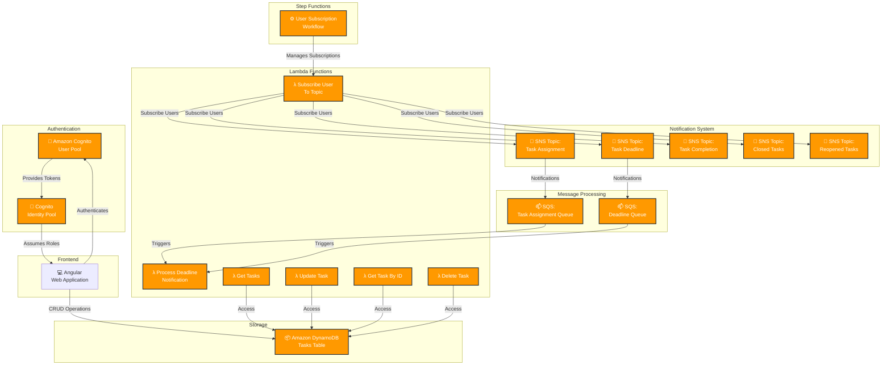

# Task Management System (TMS)

A serverless task management solution built with AWS SAM, featuring real-time notifications, role-based access control, and automated task tracking.

## Project Overview

TMS is a cloud-native application that helps teams manage tasks efficiently with features like task assignment, deadline tracking, and automated notifications. Built using AWS Serverless Application Model (SAM), it provides a scalable and maintainable solution for task management.

### Key Features

- 🔐 Secure authentication and authorization
- 📋 Task creation, assignment, and tracking
- 📢 Real-time notifications for task updates
- ⏰ Automated deadline reminders
- 👥 Role-based access control (Admin/Team Member)
- 📊 Task status monitoring
- 🔄 Automated workflow management

## Architecture

The system is built using the following AWS services:

- **Authentication**: Amazon Cognito
- **Database**: Amazon DynamoDB
- **Computing**: AWS Lambda
- **API Layer**: Amazon API Gateway
- **Notifications**: Amazon SNS, Amazon SQS
- **Workflow**: AWS Step Functions

## Prerequisites

- AWS Account
- AWS SAM CLI installed
- Node.js 14.x or later
- Python 3.12 or later
- AWS CLI configured with appropriate credentials

## Project Structure

- Important Files are listed here

```plaintext
tms_back_end
├── user_management/
│   ├── app.py
│   ├── reqirements.txt
├── hello_world/
│   ├── app.py
│   ├── reqirements.txt
├── statemachines/
│   ├── expired_tasks.asl.json
├── tests/
│   ├── unit/
│   ├── integration/
├── template.yaml
└── README.md
```

## Security
- All API endpoints are secured with Cognito authentication
- Data is encrypted at rest in DynamoDB
- Secure communication using HTTPS
- Role-based access control implemented
- Environment variables for sensitive data

### Related Repositories
- 🎯 TMS Frontend: [https://github.com/frankkwabenaaboagye/amplify-angular-template](https://github.com/frankkwabenaaboagye/amplify-angular-template)


## Architecture Diagram


